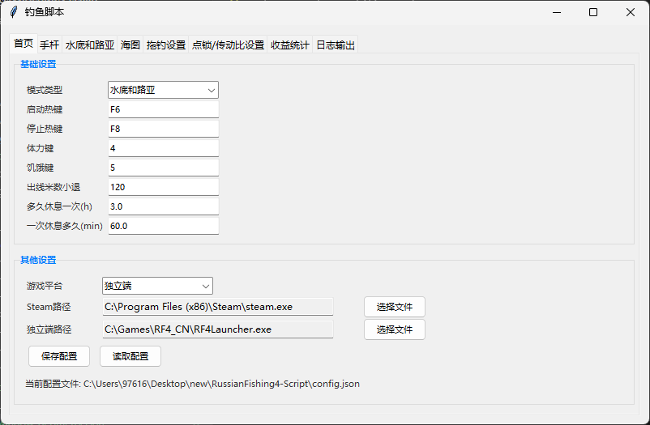

<p align="center">
  <h2 align="center">
     俄罗斯钓鱼4 自动化脚本
  </h2>

  <p align="center">
        自动化钓鱼脚本，配备集成式 UI，支持 手杆、水底、路亚 以及 海图全天候钓鱼模式，并内置连点器功能。  
      
  </p>


</p>

---

## 功能介绍

### 手杆、水底、路亚模式
- **自动寻路**：自动前往目的地，自动完成咖啡厅任务、卖鱼。
- **定时换点**：自动更换钓点，提升效率。
- **昼夜切换**：白天执行路亚模式，晚上切换至水底模式。
- **自动打窝**：支持手抛窝子、PVA棒子（暂不支持蜗杆）。
- **自动切鱼块**：自动处理捕获的鱼类。

### 海图模式
- **支持搬砖、深坑、拖钓**：拖钓需配合部分手动操作。
- **自动寻路**：自动前往目的地，自动完成咖啡厅任务、卖鱼。
- **自动换坑/回坑**：智能切换或返回钓点。
- **自动续费**：自动续费/补充船票。
- **自动更换引线、鱼饵**：确保持续钓鱼。
- **自动切鱼块**：高效处理鱼类。
- **智能切换**：电轮、鼓轮自动切换模式。


### 其他功能
- **ui界面**：便于使用。
- **全程点锁**：加快收鱼速度（注意线组搭配）。
- **补充体力食物**：自动补充体力食物。
- **自动小退**：肘击后自动小退。
- **连点器**：用于制作咖啡，快速冲熟练度。
- **上星上蓝自动截图**：记录关键时刻。
- **定时睡眠**：模拟真实操作，降低检测风险。
- **随机时间间隔**：全程随机化操作时间，进一步降低封号风险。

---

## 程序使用说明

为确保脚本正常运行，请严格按照以下说明操作：

### 基本要求
- **分辨率**：仅支持 **1920x1080** 分辨率。
- **窗口**：仅支持全屏无边框窗口。
- **语言支持**：仅支持**中文界面**及**中文简体**游戏客户端。
- **模式切换**：切换模式后需先停止程序，再重新启动。

### 手杆模式
- 配置好鱼竿并取出，启动程序，仅支持**单杆**。

### 水底模式
- 配置**三根鱼竿**，依次绑定到数字按键 **1、2、3**。
- 将窝子添加到**喜欢列表**。
- 准备充足的窝子和鱼饵，强烈建议使用**彩虹线**。

### 全天路亚模式
- 配置好鱼竿并添加到**喜欢列表**。

### 海图模式
- 仅支持**彩虹线**，需准备充足的鱼饵和引线。
- 在海上启动时，需回到船中，视角对准船头，并将船移动至目的地附近后再启动。

### 安全建议
- **避免长时间挂机搬砖**：睡眠时间越长越安全，长时间连续高收益操作极易导致封号。
- **后台运行**：不支持后台运行。如需后台运行，建议在高配置环境下使用虚拟机（如 VMware）。
- **风险提示**：使用脚本存在封号风险，请自行承担后果。

---

## 开发环境搭建

### 开发模式
- **CPU环境**：兼容性强（推荐）
- **GPU环境**：图像识别速度更快
- **Python版本**：**3.13.5**

#### 创建CPU环境
```bash
python -m venv venv_cpu
venv_cpu\Scripts\activate
python.exe -m pip install --upgrade pip
pip install -r requirements_cpu.txt
```

#### 创建GPU环境
```bash
python -m venv venv_gpu
venv_gpu\Scripts\activate
python.exe -m pip install --upgrade pip
pip install -r requirements_gpu.txt
# 查看CUDA版本
nvidia-smi
# 根据CUDA版本从官网获取下载链接
python -m pip install paddlepaddle-gpu==3.2.0 -i https://www.paddlepaddle.org.cn/packages/stable/cu129/
```

> **注意**：请访问 [PaddlePaddle官网](https://www.paddlepaddle.org.cn/install/quick?docurl=/documentation/docs/zh/develop/install/pip/windows-pip.html) 获取正确的CUDA版本安装链接。

---

## 运行与打包

### 运行方式

#### CPU环境
```bash
venv_cpu\Scripts\activate
python main.py
```

#### GPU环境
```bash
venv_gpu\Scripts\activate
python main.py
```

### 打包方式

#### CPU环境
```bash
venv_cpu\Scripts\activate
pyinstaller --clean main_cpu.spec
```

#### GPU环境
```bash
venv_gpu\Scripts\activate
pyinstaller --clean main_gpu.spec
```

---

## 注意事项
- 首次启动需要等待一定时间。
- 脚本运行期间，**请勿随意干扰**脚本操作。
- 为降低封号风险，建议合理设置**睡眠时间**并避免长时间连续运行。
- 本脚本仅为自动化辅助工具，使用者需自行承担使用风险。
- 此脚本仅用于学习交流。

## 贡献与反馈

通过 GitHub Issues 或 Pull Requests 提交问题或建议，提供系统环境、日志和重现步骤。

## 许可证

MIT 许可证（详见 LICENSE）。DLL 版权归 mono 所有，遵守其许可协议。

